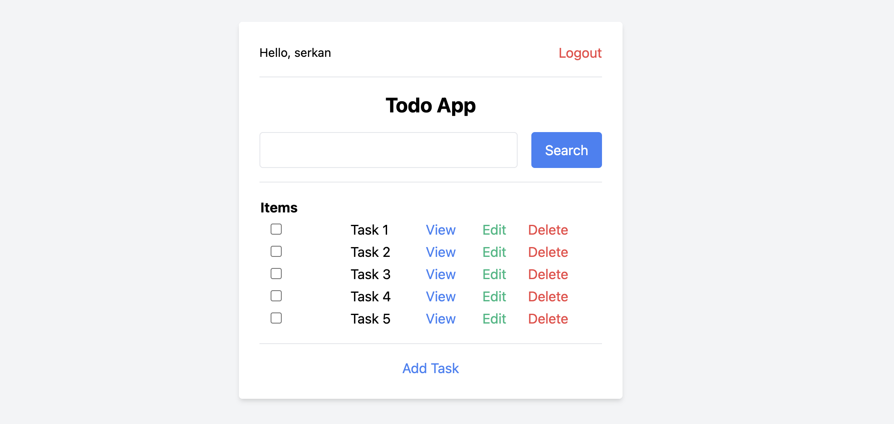
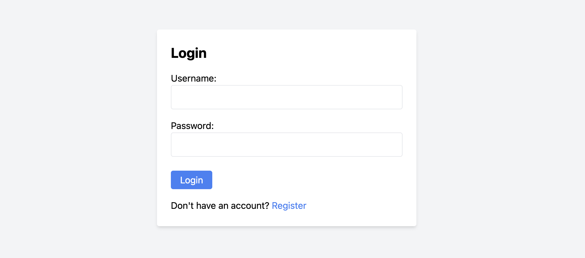

# Todo App

## Overview

- This is a basic todo application with an authentication system made with django and tailwindcss.
 
 


## Installation

1. **Clone the repository:**

    ```sh
    git clone https://github.com/serkanburul/Django-Todo-App.git
    cd Django-Todo-App
    ```

2. **Create and activate a virtual environment:**

    ```sh
    python3 -m venv env
    source env/bin/activate
    ```

3. **Install the dependencies:**

    ```sh
    pip install -r requirements.txt
    ```

4. **Set up the database:**

    ```sh
    python manage.py makemigrations
    python manage.py migrate
    ```

5. **Create a superuser:**

    ```sh
    python manage.py createsuperuser
    ```

6. **Run the development server:**
 
    ```sh
    python manage.py runserver
    ```

    The project will be available at `http://127.0.0.1:8000/`
